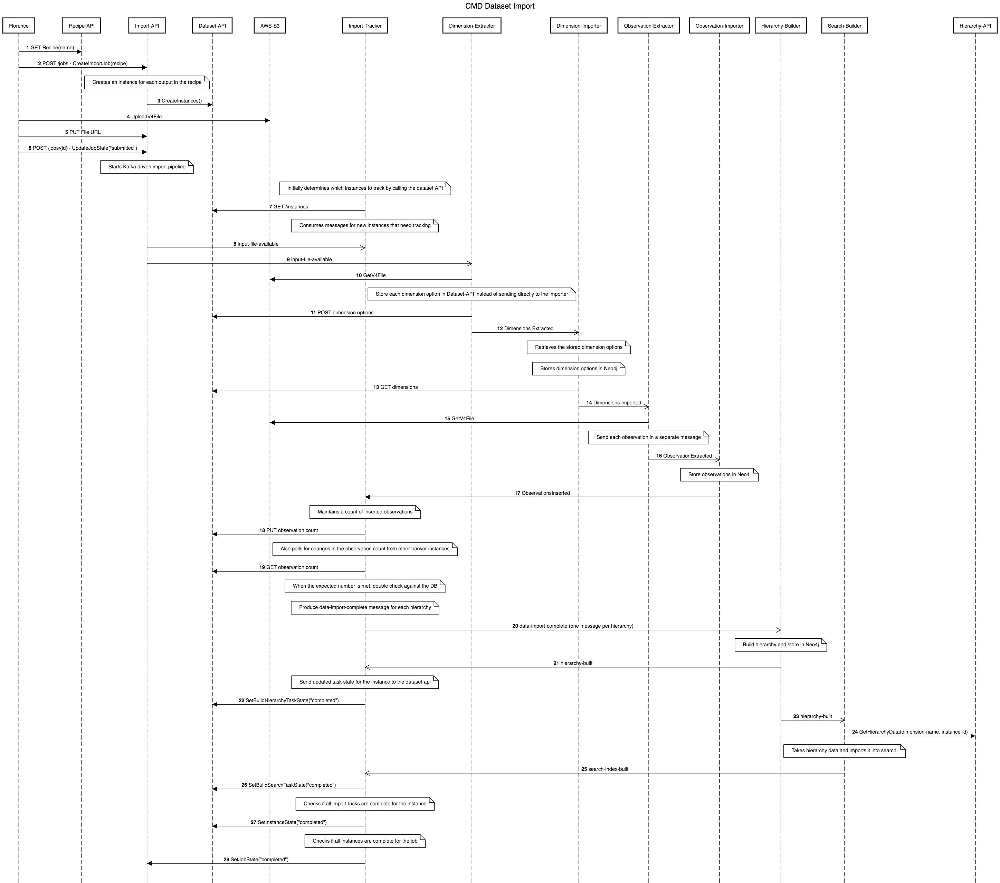

The source script for the diagram is maintained in sequence.txt.

To update the diagram:
- Copy the source script into [sequencediagram.org](http://sequencediagram.org)
- Update the diagram as required
- Export as an image on [sequencediagram.org](http://sequencediagram.org)
- Copy the updated source script back into sequence.txt and commit.

